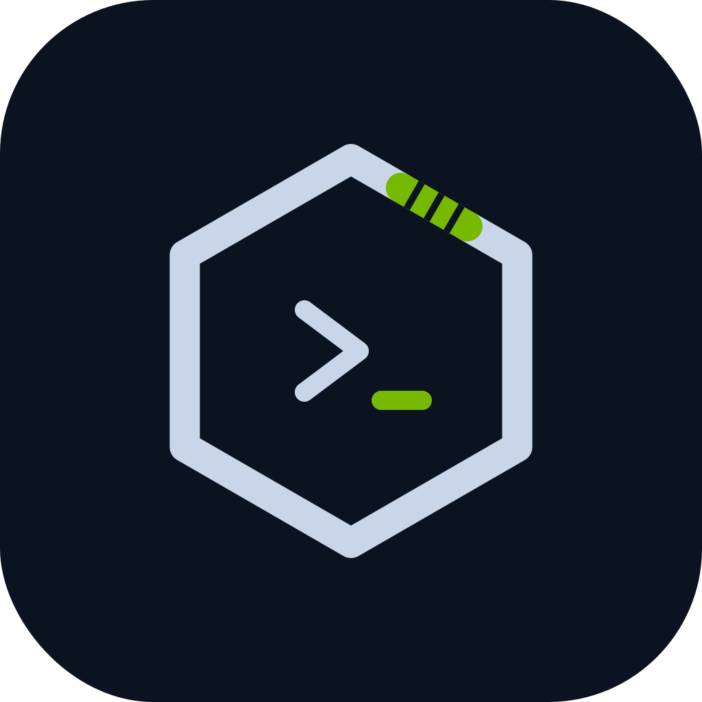

<p align="center">
  
</p>

# Mender: Kubernetes Incident-to-Fix Agent

Mender takes a broken Kubernetes service and returns a verified fix: it finds the root
cause, writes a patch, tests the patch in an isolated sandbox, and opens a pull request
with the evidence attached. A human reviews and merges — **Mender never merges anything
itself.**

## Architecture

<details>
<summary>Architecture diagram (inline SVG)</summary>

<svg viewBox="0 0 900 520" xmlns="http://www.w3.org/2000/svg" font-family="system-ui, -apple-system, 'Segoe UI', Roboto, sans-serif" style="max-width:100%; height:auto; border:1px solid #bfc0c0; border-radius:8px;">
  <defs>
    <style>
      .paper { fill: #f5f5f5; }
      .ink { fill: #2d3142; }
      .muted { fill: #4f5d75; }
      .soft { fill: #7a8399; }
      .accent { fill: #eb6c36; }
      .link { fill: #2e5aa8; }
      .rule { stroke: #bfc0c0; stroke-width: 1; }
      .node { fill: #ffffff; stroke: #2d3142; stroke-width: 1; rx: 8; ry: 8; }
      .node-accent { fill: #ffffff; stroke: #eb6c36; stroke-width: 1.5; rx: 8; ry: 8; }
      .node-paper { fill: #ececec; stroke: #bfc0c0; stroke-width: 1; rx: 8; ry: 8; }
      .arrow { stroke: #4f5d75; stroke-width: 1; fill: none; }
      .arrow-link { stroke: #2e5aa8; stroke-width: 1; fill: none; }
      .label { font-size: 12px; fill: #2d3142; font-weight: 600; }
      .sublabel { font-size: 9px; fill: #7a8399; font-family: ui-monospace, 'JetBrains Mono', Menlo, monospace; }
      .eyebrow { font-size: 8px; fill: #7a8399; letter-spacing: 0.18em; text-transform: uppercase; font-weight: 500; }
      .accent-label { font-size: 12px; fill: #2d3142; font-weight: 600; }
      .title { font-size: 14px; fill: #2d3142; font-weight: 600; }
    </style>
  </defs>

  <rect class="paper" width="900" height="520" rx="0"/>
  <text x="32" y="34" class="title">Mender architecture</text>
  <text x="32" y="48" class="soft" style="font-size:10px;">Incident → triage → root cause → patch → sandbox → PR. A human reviews; Mender never merges.</text>

  <text x="32" y="86" class="eyebrow">Kubernetes cluster</text>
  <rect class="node-paper" x="32" y="96" width="240" height="300"/>
  <text x="44" y="116" class="sublabel">kind · namespace shop</text>
  <rect class="node" x="48" y="128" width="208" height="64"/>
  <text x="60" y="148" class="label">checkout service</text>
  <text x="60" y="164" class="sublabel">Deployment + Service + 21 invariant checks</text>
  <rect class="node" x="48" y="204" width="208" height="52"/>
  <text x="60" y="222" class="label">fault injection</text>
  <text x="60" y="238" class="sublabel">demo/inject.py · apply/cleanup per fault.yaml</text>
  <rect class="node" x="48" y="268" width="208" height="56"/>
  <text x="60" y="286" class="label">evidence: events, logs, manifests</text>
  <text x="60" y="302" class="sublabel">kubectl get/describe · pod status · container logs</text>

  <text x="332" y="86" class="eyebrow">Mender agent</text>
  <rect class="node-accent" x="332" y="96" width="236" height="300"/>
  <text x="344" y="116" class="sublabel">src/mender · Python 3.12 · mypy strict</text>
  <rect class="node" x="348" y="128" width="204" height="44"/>
  <text x="360" y="144" class="accent-label">triage  (nano)</text>
  <text x="360" y="160" class="sublabel">evidence → signals + suspects</text>
  <rect class="node" x="348" y="184" width="204" height="52"/>
  <text x="360" y="200" class="label">Tavily search</text>
  <text x="360" y="216" class="sublabel">advanced depth · ranked sources · cited</text>
  <rect class="node" x="348" y="248" width="204" height="44"/>
  <text x="360" y="264" class="accent-label">root cause  (ultra)</text>
  <text x="360" y="280" class="sublabel">evidence + web sources → report</text>
  <rect class="node" x="348" y="304" width="204" height="44"/>
  <text x="360" y="320" class="accent-label">patch  (super)</text>
  <text x="360" y="336" class="sublabel">allowed files only · path escapes rejected</text>

  <text x="632" y="86" class="eyebrow">Nebius Token Factory</text>
  <rect class="node-paper" x="632" y="96" width="236" height="80"/>
  <text x="644" y="116" class="sublabel">OpenAI-compatible API</text>
  <text x="644" y="132" class="sublabel">https://api.tokenfactory.nebius.com/v1/</text>
  <rect class="node" x="648" y="140" width="204" height="36"/>
  <text x="660" y="155" class="label" style="font-size:11px;">nano · triage · $0.06/$0.24</text>
  <rect class="node" x="648" y="184" width="204" height="36"/>
  <text x="660" y="199" class="label" style="font-size:11px;">ultra · root cause · $1.00/$3.00</text>
  <rect class="node" x="648" y="228" width="204" height="36"/>
  <text x="660" y="243" class="label" style="font-size:11px;">super · patch + repair · $0.30/$0.90</text>

  <text x="632" y="290" class="eyebrow">Sandbox</text>
  <rect class="node-paper" x="632" y="300" width="236" height="72"/>
  <text x="644" y="318" class="sublabel">Docker · --network none</text>
  <rect class="node" x="648" y="330" width="204" height="34"/>
  <text x="660" y="348" class="label" style="font-size:11px;">runs test command · max_retries 3</text>

  <text x="632" y="386" class="eyebrow">Pull request</text>
  <rect class="node" x="632" y="396" width="236" height="92"/>
  <text x="644" y="414" class="label">gh pr: root cause · evidence · diff</text>
  <text x="644" y="430" class="sublabel">test results · Tavily sources</text>
  <text x="644" y="446" class="soft" style="font-size:10px;">Never merges — human reviews.</text>

  <path class="arrow-link" d="M 272 180 C 300 180, 320 180, 328 180"/>
  <text x="296" y="174" class="sublabel" style="font-size:8px;">evidence</text>
  <path class="arrow-link" d="M 456 210 C 490 210, 520 210, 560 210"/>
  <path class="arrow-link" d="M 560 210 L 632 132"/>
  <text x="500" y="204" class="sublabel" style="font-size:8px;">queries</text>
  <path class="arrow-link" d="M 632 150 C 560 150, 520 150, 456 210"/>
  <text x="540" y="144" class="sublabel" style="font-size:8px;">sources</text>
  <path class="arrow" d="M 452 172 L 452 184"/>
  <path class="arrow" d="M 452 232 L 452 248"/>
  <path class="arrow" d="M 452 292 L 452 304"/>
  <path class="arrow-link" d="M 456 264 C 490 264, 520 264, 560 264"/>
  <path class="arrow-link" d="M 560 264 L 632 150"/>
  <text x="500" y="258" class="sublabel" style="font-size:8px;">queries</text>
  <path class="arrow-link" d="M 556 326 L 632 320"/>
  <text x="590" y="316" class="sublabel" style="font-size:8px;">patch</text>
  <path class="arrow-link" d="M 750 368 L 750 396"/>
  <text x="756" y="384" class="sublabel" style="font-size:8px;">verified</text>

  <rect class="node-paper" x="32" y="420" width="836" height="72"/>
  <text x="44" y="440" class="eyebrow">Usage ledger (append-only)</text>
  <text x="44" y="458" class="sublabel">Every model call + Tavily call recorded: tokens, reasoning tokens, latency, cost per tier, failures.</text>
  <text x="44" y="474" class="sublabel">Reports and eval rows trace back to what they actually cost — no invented numbers.</text>
</svg>

</details>

Every stage appends to a usage ledger (tokens, latency, cost per tier, Tavily call
counts), so every report and every eval row can be traced back to what it actually
cost.

## Quickstart

```bash
git clone <repo> && cd mender
uv sync                                   # Python 3.12, all deps

cp .env.example .env                      # then fill in:
#   NEBIUS_API_KEY=...   (Nebius Token Factory)
#   TAVILY_API_KEY=...   (Tavily)

make test                                 # ruff + mypy strict + pytest
make demo                                 # kind cluster + 1-command incident demo

uv run mender diagnose --service checkout --namespace shop
uv run mender run      --service checkout --namespace shop \
    --workdir . --test-files demo/manifests/deploy.yaml \
    --test-command "python3 demo/app/check.py"
uv run mender eval --settle 25 --out results/$(date +%F)
```

`mender pr` then opens the PR from a finished run (mode `gh`), or `--pr-mode prepare`
writes the branch and PR body without touching GitHub.

### Demo in one command

```bash
make demo        # = demo/demo.sh
```

sets up the `kind` cluster, deploys the sample checkout service (21 invariant checks
pass), injects a chosen fault, and runs the full pipeline to a prepared PR.

### Fault catalogue

`demo/faults/<id>/fault.yaml` — 23 faults across seven categories (app bugs, probes,
configuration, secrets, resources, scheduling, services/migrations). Each declares its
apply/cleanup snippet, which files it touches, and the `expected_labels` used for
scoring, so every eval row is programmatic rather than a hand-judged pass.

## Configuration

`mender.yaml` is the single source of configuration; `.env` carries secrets (gitignored,
names only in `.env.example`).

```yaml
router:
  base_url: https://api.tokenfactory.nebius.com/v1/
  max_retries: 1            # then a typed error — no silent cross-tier fallback
  tiers:
    nano:  { model: ..., max_tokens: 8192, price: { input_per_m: ..., output_per_m: ... } }
    ultra: { ... }
    super: { ... }
tavily:
  search_depth: advanced    # max_results, timeout, retries with backoff
sandbox:
  image: python:3.12-slim   # max_retries: 3, timeout_s: 900
```

Price entries carry a `source` note. Where Nebius publishes no official table (the nano
tier), the config says so and names the third-party aggregators the figure came from —
prices are never invented.

## Model tiers

| Tier | Model | Used for | Input / Output (USD per 1M tok) |
|---|---|---|---|
| nano | `nvidia/NVIDIA-Nemotron-3-Nano-30B-A3B` | triage: reduce raw evidence to signals and suspects | $0.06 / $0.24 — third-party aggregators, Nebius publishes no table |
| ultra | `nvidia/Nemotron-3-Ultra-550b-a55b` | root-cause report, search-query planning | $1.00 / $3.00 — models.dev |
| super | `nvidia/nemotron-3-super-120b-a12b` | patch writing and test-driven repair | $0.30 / $0.90 — models.dev |

Design points, each verified against the live API:

- **Tiering by job, not by hope** — cheap triage at high volume, expensive reasoning
  once per incident, mid-tier patch writing with a bounded repair loop.
- **No cross-tier fallback.** A failed call retries once with backoff, then raises a
  typed error. Falling back to a different tier would silently change cost and quality.
- **Nemotron models are reasoning models.** Small `max_tokens` starves the `content`
  field (reasoning eats the whole budget and the reply comes back empty), so tiers are
  configured with 8k–16k output budgets and the JSON-repair path folds an explicit
  no-reasoning nudge into the system message — the failure mode was reproduced on the
  live API and the fix verified against the exact starving prompt.
- **Every call is accounted**: tier, model, prompt/completion/reasoning tokens, latency,
  computed cost — appended to `usage.jsonl` per run.

## Tavily

Tavily is a first-class component of diagnosis, not a bolt-on search box:

1. The ultra tier proposes 1–3 queries from the triage summary and evidence.
2. All queries run in parallel-ish sequence against Tavily (`advanced` depth, bounded
   retries with backoff on 429/error).
3. Ranked results become **numbered citations** in the root-cause report
   (`[1] [2] ...` with title + URL + snippet), and the report's markdown lists every
   source.
4. The PR body repeats the sources, so a reviewer can check the web evidence without
   leaving GitHub.
5. **Degraded mode never blocks**: if Tavily fails after retries, diagnosis proceeds on
   cluster evidence alone and the report is explicitly marked
   *"Tavily search was degraded for some queries — sources may be incomplete."*
   Tavily calls are recorded in the same usage ledger (count + latency; Tavily is billed
   per search credit, plan-dependent, so no USD figure is invented for it).

## Eval harness

```bash
uv run mender eval --settle 25 --out results/2026-10-06 --work-dir runs/eval
```

runs every fault in the catalogue end-to-end: clone the repo, inject, wait for symptoms,
collect evidence, run the pipeline, verify in the sandbox, clean up — one case per fault,
with evidence isolated between cases.

Metric definitions (fixed before the first run):

- **root-cause accuracy** = cases where normalized predicted labels ∩ expected labels
  is non-empty, over cases run;
- **fix-pass rate** = cases whose sandbox tests went green within the bounded retry
  count;
- **median time-to-PR** over cases that reached a prepared PR;
- **cost per tier** summed from the ledger — `null` when any call in that tier had no
  published price (never estimated).

Raw results are committed under `results/<date>/eval-v1.json` (`schema_version:
mender-eval-v1`) with a per-fault breakdown including failures.

### Results (2026-10-06, 23-fault demo cluster, `--settle 25`, `pr_mode=prepare`)

Committed raw output: `results/2026-10-06/eval-v1.json` (`schema_version: mender-eval-v1`).

| Metric | Value |
|---|---|
| Cases run | 23 |
| Root-cause accuracy | 9/23 (0.391) |
| Fix-pass rate | 20/23 (0.870) |
| Median time-to-PR-ready | 33.8 s (n=20) |
| Nano cost USD | $0.023 (25 calls, 307,405 tok) |
| Super cost USD | $0.190 (30 calls, 456,320 tok) |
| Ultra cost USD | $0.824 (46 calls, 663,539 tok) |
| Tavily cost USD | not reported (per-credit, plan-dependent; 69 calls logged with count + latency) |

Failures (3):

- `cpu-limit-missing` — `verify-failed` (sandbox did not go green within the retry bound).
- `migration-missing-column` — `error`: `PatchError: patch path outside allowed set: demo/manifests/deploy.yaml`.
- `parse-amount-bug` — `error`: `PatchError: patch path outside allowed set: demo/manifests/deploy.yaml`.

The two `patch path outside allowed set` failures share a single cause: the model's repair patch wrote to `demo/manifests/deploy.yaml`, which is not in the fault's allowed `files` set (the fault touches migration/sql + app code). The patch was rejected by `validate_patch` before it reached the sandbox, so the case never reached verification. This is the allow-set doing its job (it stopped an out-of-scope write) but it also means the model did not propose a fix restricted to the allowed files for those two cases.

For comparison, the first full eval (same cluster, before the failure-mode fixes in commit `de04a02`) scored root-cause 7/23 (0.304) and fix-pass 18/23 (0.783), with 5 failures (4× JSONError from the runaway-reasoning loop and 1× cpu-request-too-high inject-failed). The current run's 3 failures are a different, narrower set: 1× verify-failed + 2× allow-set rejection.

## Limitations

- **Sandbox is local Docker, not Nebius.** Nebius Token Factory has no Serverless
  Jobs/Endpoints (verified: only dedicated endpoints exist), so the sandbox runs local
  Docker behind the `SandboxRunner` interface — a remote runner can drop in unchanged,
  but it is not built.
- **Root-cause scoring is label intersection**, which is deliberately strict: a report
  that names the right mechanism with unexpected label vocabulary scores as a miss.
  Expect this metric to understate semantic correctness.
- **Nemotron pricing for the nano tier is third-party sourced** — Nebius publishes no
  per-model price table. The provenance is recorded in `mender.yaml`.
- **Tavily cost is not reported in USD** because it is billed per search credit on a
  plan-dependent basis; call counts and latency are reported instead.
- **The demo cluster is a single-node kind cluster** running one sample service; the
  fault catalogue covers common failure classes but not multi-node networking,
  autoscaling, or RBAC failures.
- **Mender prepares PRs, it never merges.** Merge policy, CODEOWNERS, and required
  reviews remain entirely human.
- **Reasoning-model nondeterminism is real**: at temperature 0 the same prompt can
  still diverge into a runaway-reasoning loop occasionally; the repair path catches it,
  but a case can fail if both attempts starve.

## Development

```bash
make test        # uv run ruff check + ruff format --check + mypy + pytest
make serve       # mender serve on :8080 (GET /healthz, POST /diagnose, POST /run)
docker build -t mender .   # python:3.12-slim + kubectl
```

- `src/mender/` — package (mypy strict, fully typed)
- `demo/` — kind cluster setup, sample app, 23-fault catalogue, injection tooling
- `results/` — committed eval outputs
- `PLAN.md` — phase plan; `REVIEWS.md` — external review audit trail

## License

Apache-2.0 — see [LICENSE](LICENSE).
